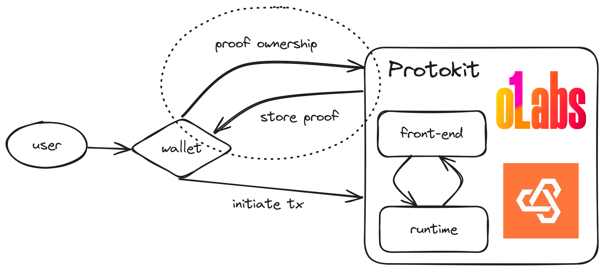

  <h1 align="center">POPKORN </h1>
  <h3>Proof Of Private Key Ownership Requiring Nothing</h3>

🔑 Navigating the complexities of private keys and digital signatures can be a challenge for average users, and mistakes can result in loss of funds. To address this, we propose a wallet solution built on Mina, leveraging Protokit, which eliminates the need for complex seed phrase management and simplifies digital signatures.

This approach reduces the likelihood of errors and facilitates easier integration with dApps, without significant changes to infrastructure and processes.

⚙️ Built on o1js, Protokit, Rust, Typescript and React.

## Flow

<!-- ## Screenshots -->

## Bounties and prizes

### ZK Hack- Finalist and hacker's choice

POPKORN redefines UX in the web3 space, by removing the need for signatures to proof ownership of a wallet. Our dapp allows users generate a ZKP on the client-side one time, which can be stored in the wallet. This way, future transactions can be initiated without having to sign a message first.

### Mina - Build a zkAppChain using Protokit Framework

Our project is build completely with the Protokit framework. We created a zkAppChain that aims to improve UX, by replacing signing transactions to proof ownership by ZKP's using 01js. Our zkAppchain is build using the Protokit quickstart guide and with help from Matej. Also our frontend is based on what is provided by the Protokit framework.

## Links

- [Presentation slides](https://docs.google.com/presentation/d/1KsH8dfkHxh_S-ENTSYl6FZjqb5jeqBSUiHppih2us64/edit?usp=sharing)
<!-- - [Demo video]() -->
- [Devfolio project](https://devfolio.co/projects/popkorn-61b7)
- [Modified Protokit SDK repo](https://github.com/private-key-black-box/protokit-sdk)

## Team

This project is build for ZK Hack Krakow 2024 by:

- [Scott](https://github.com/tuddman)
- [Cleaner](https://kacperkarbownik.xyz/)
- [Thomas](https://www.linkedin.com/in/thomas-turek-a953a6232/)
- [arjanjohan](https://twitter.com/arjanjohan)
